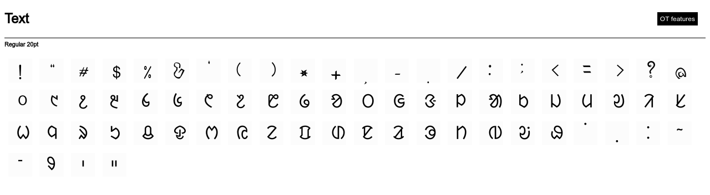

# Uniol Unicode compliant Ol Chiki / Ol Cemet Font
This font design is taken from OlChiki code page of unicode.org

This font is now available in Fedora as uniol-fonts 
and in Debian/ Ubuntu as font-uniol